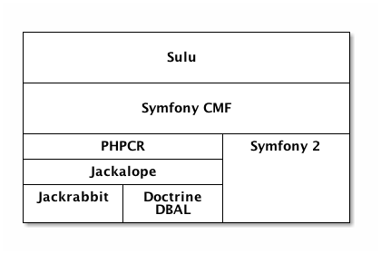

# Introduction
MASSIVE ART WebServices[^1] in Dornbirn is currently implementing a new open
source content management framework named Sulu[^2]. The most fundamental base
for this project is the PHP framework Symfony2[^3]. Another important part of
Sulu is PHPCR[^4], which is a project defining some interfaces for a content
repository. This specification is based on JCR[^5] (Java Content Repository).

The concrete implementation of this interface used by Sulu is Jackalope[^6],
which also includes some different transport layers. At the moment there are
layers for Jackrabbit[^7], which is an implementation of a content repository
from the apache foundation, and for Doctrine DBAL[^8], which is database
abstraction layer. This means that  a relational database can also serve as a
content repository.

## Scientific problem

Jackrabbit already supports versioning of content, so it was very easy to
implement this in Jackalope. However, at the moment the Doctrine DBAL transport
layer does not have any versioning capabilities. The goal of this thesis is to
add this functionality to this transport layer.

The biggest challenges for this implementation is to find a good and performant
way to store the different versions in a relational database. Therefore the
already existing schema has to be extended, which has also to be accepted by
the open source community.

Another problem-causing issue could be the fact that the versioning is working
only on Jackrabbit at the moment. The interface definition is designed for the
usage with this database, so another implementation would be a great way to
check if the interface also fits for the more general approach, which PHPCR is
actually targeting.

There are also plans for versioning functionalities in Sulu, which would make
use of this implementation. Since Sulu has some very special types of content,
there will be even more problems to face. For instance pages can have links to
other pages, whereby these links have to be versioned as well. Then it is not
completely clear if the referenced pages need to be stored in an own version as
well. An even bigger challenge is the versioning of a smart content, which
filters other pages by certain criteria. If these criteria are versioned, the
result would not be the same after restoring an older version, whether this is
intented or not.

A very interesting use case, which could already be useful for some clients of
MASSIVE ART, is to surf the content of the website from a specific date. This
would especially be helpful for legal concerns, e.g. if a company gets sued for
having a wrong or even damage-causing manual on their website.

The performance of this functionality is not a very high prioritized item,
since it is not thought to be used every single day. However, the performance
has quite a big impact on search engine optimization, since some website
crawler added this factor as a criteria for the ranking of the website, so that
slow websites are ranked worse.This implies that these crawlers have to be kept
out if this functionality is used.

## Sulu Components
This chapter will introduce the current situation of Sulu in more detail.
Figure 1.1 presents the dependencies as a layer digram. On top is our project,
which makes use of some components from the Symfony CMF. The Symfony CMF, an
open source project initiated by the swiss agency Liip[^9], depends on Symfony
and PHPCR. PHPCR is just an interface for accessing a content repository. Sulu
uses Jackalope as a concrete implementation, for which two transport layers are
available, one for Doctrine DBAL and one for Jackrabbit.

The following paragraphs will explain each of these components separately.

### Symfony2
Symfony2 is the most important framework used by Sulu. It can be used as a
standalone set of php components, or as a php framework for building web
applications. [see @symfony2014a]

It offers different functionalities widely used by different web applications,
like dependency injection, event dispatching, form rendering and interpreting,
localization, routing URLs and authorization. [see @symfony2014b]

Symfony2 also leverages the concept of bundles. A bundle contains all the
public (stylesheets, scripts, images, fonts, ...) and non-public files (php,
configuration definitions, ...) implementing a certain feature.
[see @symfony2014c]

This feature enables the possibility to share code written for Symfony2 across
different projects. The Sulu project offers multiple of these bundles, which
can be separately activated or deactivated. Sulu is also using many other third
party and symfony bundles.

### PHPCR
PHPCR is an interface definition for accessing a content repository. It is an
adapted version of the Java Content Repository.

The API is built with content management in mind. PHPCR stores weak structured
data as documents in hierachical trees, so it combines the best of
document-orientated and XML databases. In addition to that it also adds
features like searching, versioning and access control. [see @phpcr2014a]

PHPCR also enables Sulu to store content in a very dynamic way. Sulu can define
the structure of a content, and it can be applied to the database without
changing the database schema.

### Jackalope
The most popular PHPCR implementation is Jackalope. Jackalope implements the
API in an storage agnostic way. [see @jackalope2014a] Therefore an exchangeable
storage layer was introduced. Currently there are storage layers for Jackrabbit
and Doctrine DBAL. Unfortunately Jackalope does not implement all of the
described features in PHPCR yet. [see @phpcr2014b]

There are also some differences regarding the feature completeness between the
storage layers, because not every feature can be implemented storage agnostic.
For instance versioning is currently only implemented in the Jackrabbit storage
layer, because versioning is already managed by Jackrabbit. The focus of this
thesis is to add versioning support to the Doctrine DBAL storage layer.

The implementation of versioning in the Doctrine DBAL layer would result in
some advantages for Sulu. Since Sulu is an open source project, it should run
on as many server configurations as possible. If we rely on Jackrabbit, which
runs on Java, we would exclude many potential users using e.g. managed servers.
And also for users administrating their servers by themselves, it would
generate benefits, since it results in an easier and less resource consuming
setup. Sulu requires a RDBMS for its structured data anyway, so it can be run
with a single database, instead of a combination of Jackrabbit and a RDBMS. And
due to the database abstraction it should not be too hard to change to
Jackrabbit later, if needed.

### Doctrine DBAL
The Doctrine project offers several PHP libraries primarily focused on database
storage. The most popular product is its ORM (Object Relational Mapping), which
is widely used in many different PHP projects. The Doctrine ORM can be seen as
the PHP counterpart to Hibernate in Java, from which Doctrine draw a lot of
inspriation.
[see @doctrine2014a]

The Doctrine ORM is built on top of another Doctrine project: Doctrine DBAL.
DBAL stands for "Database Abstration Layer", and acts as an abstraction for
PDO, which is PHP's internal object-orientated database abstraction.
[see @doctrine2014b] However, PDO only abstracts database access from different
database drivers, which means it does not rewrite the queries for database or
emulate missing features.[see @php2014a]

This also explains the need for another layer. So Doctrine DBAL adds
functionality like an object-oriented QueryBuilder, a SchemaManager for
introspecting database schemas, some events or caching on top of PDO.

### Apache Jackrabbit
Jackrabbit is a database implementing the JCR specification, and therefore acts
as a content repository. As such it is optimized on storing semi-structured
content in a hierarchy. It additionally adds support for full text search,
versioning, transactions and observations on a database level. Of course the
most interesting feature for this thesis is the versioning.

### Symfony CMF
The Symfony community has implemented its vision of the decoupled CMS, and
called it Symfony CMF. It contains various Symfony bundles, which should enable
other developers to easily add CMS functionality to their Symfony applications.

The Symfony CMF is built upon, as the name already suggests, Symfony, and some
parts are also relying on PHPCR. Some bundles contain technical foundations,
and others offer very basic content management functionality. So it is
possible to build a custom CMS within 50 minutes. [see @dbuchmann2014a]

For Sulu we are currently only using the Routing functionality of the Symfony
CMF. Thanks to the decoupled architecture, we are not forced to include all the
other components, which do not fit our complex requirements. The RoutingBundle
extends Symfony's internal routing, which is responsible for mapping URLs to
controllers. However, it is only capable of handling routes in static
configuration files. This is not sufficient for a CMS, because content managers
usually want to define their own URLs. With the RoutingBundle it is possible to
dynamically load the routing configuration from a database, where it can be
configured by the content manager.

## Requirements

The goal of this thesis is to implement the most essential features of
versioning for Jackalope Doctrine DBAL. The most important features are
creating a new version and restoring an existing version.

Furthermore the implementation has to be compatible with other projects
following the JCR or PHPCR specification. This especially includes Jackrabbit,
since it is the reference implementation of the JCR specification. It should
be easily possible to export the data into an XML file, which is also specified
in JCR [see @jcr2015c], and import it for instance into Jackrabbit. All the
content, versions, and current states of the content should be available in the
same way as it was before in the other JCR implementation.

This compatibility does not only deal with other JCR implementations, but also
other applications relying on the JCR specification. This involves not only
Sulu from MASSIVE ART, but also magnolia[^10], which is a Java CMS based on
Jackrabbit and some other tools like the PHPCR Browser[^11] and the PHPCR
Shell[^12], which both support browsing a JCR based content repository.

The probably most important requirement is that the work of this thesis will be
merged back into the actual Jackalope project. Therefore a close collaboration
with the maintainers of this open source project is very important.

## Acknowledgements

First of all I want to show my gratitude to MASSIVE ART, for giving me the
possibility to mainly work on open source projects, especially Sulu, but also
Jackalope, the Symfony CMF and other bundles we use for the development of
Sulu.

Of course I would also like to thank the entire open source community building
awesome products like PHP, Symfony, Symfony CMF, Jackalope and so on. Without
this effort the development of a content management solution would be an
incomparable higher amount of work. Special thanks go to David Buchmann and
Daniel Leech, for supporting me a lot during the implementation part of this
thesis. I also express my gratitude to Lukas Smith, for supporting Sulu
wherever he can and pushing its popularity.

Additional thanks go to Daniel Leech, Florian Mathis and Philip Heimböck for
proof-reading this thesis.

Last but not least I thank my parents for giving me the opportunity to study 
and supporting me during my studies.

[^1]: <http://www.massiveart.com>
[^2]: <http://www.sulu.io>
[^3]: <http://symfony.com/>
[^4]: <http://phpcr.github.io/>
[^5]: <https://jcp.org/en/jsr/detail?id=170>
[^6]: <http://jackalope.github.io/>
[^7]: <http://jackrabbit.apache.org/>
[^8]: <http://www.doctrine-project.org/projects/dbal.html>
[^9]: <http://www.liip.ch>
[^10]: <https://www.magnolia-cms.com/>
[^11]: <https://github.com/marmelab/phpcr-browser>
[^12]: <https://github.com/phpcr/phpcr-shell>

