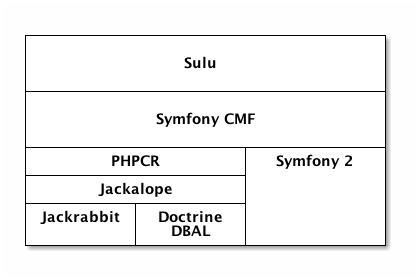

# Current situation
This chapter will introduce the current situation in more detail. Figure 1 
presents the dependencies as a layer digram. On top of is our CMF, which makes
use of some components from the Symfony CMF. The Symfony CMF, an open source
project initiated by the swiss agency Liip[^9], depends on Symfony and PHPCR.
PHPCR is, as already described, just an interface for accessing a content
repository. The actual implementation Sulu uses is Jackalope, for which two
transport layers are available, one for Doctrine DBAL and one for Jackrabbit.

The following paragraphs will explain each of this components separately.

## Symfony2
As already mentioned, Symfony2 is the most important framework used by Sulu.
It can be used as a standalone set of php components, or as a php framework for
building web applications. [see @symfony2014a]

It offers different functionalities widely used by different web applications,
like dependency injection, event dispatching, form rendering and interpreting,
localization, routing URLs and authorization. [see @symfony2014b]

Symfony2 also leverages the concept of bundles. A bundle contains all the
public (stylesheets, scripts, images, fonts, ...) and non-public files (php,
configuration definitions, ...) implementing a certain feature.
[see @symfony2014c]

This feature makes it easily possible to share code written for Symfony2 across
different projects. The Sulu project offers multiple of these bundles, which
can be separately activated or deactivated. Sulu is also using many other third
party and symfony bundles.

## PHPCR
PHPCR is an interface definition for accessing a content repository. It is an
adapted version of the Java Content Repository.

The API is built with content management in mind. PHPCR stores weak structured
data as documents in hierachical trees, so it combines the best of
document-orientated and XML databases. In addition to that it also adds
features like searching, versioning and access control. [see @phpcr2014a]

PHPCR also enables Sulu to store content in a very dynamic way. Sulu can define
the structure of a content, and it can be applied to the database without
changing the database schema. Due to the storage layer it is also possible to
use this dynamic structure in combination with a relational database system.

## Doctrine DBAL
The Doctrine project offers several PHP libraries primarily focused on database
storage. The most popular product is its ORM, which is widely used in many
different PHP projects. The Doctrine ORM can be seen as the PHP counterpart to
Hibernate in Java, from which Doctrine draw a lot of inspriation.
[see @doctrine2014a]

The Doctrine ORM is built on top of another Doctrine project: Doctrine DBAL.
DBAL stands for "Database Abstration Layer", and acts as an abstraction for
PDO, which is PHP's internal object-orientated database abstraction.
[see @doctrine2014b] However, PDO only abstracts database access from different
database drivers, which means it does not rewrite the queries for database or
emulate missing features.[see @php2014a]

This also explains the need for another layer. So Doctrine DBAL adds
functionality like an object-oriented QueryBuilder, a SchemaManager for
introspecting database schemas, some events or caching on top PDO.

## Apache Jackrabbit
Jackrabbit is a database implementing the previously mentioned JCR
specification, and therefore acts as a content repository. As such it is
optimized on storing semi-structured content in a hierarchy. It additionally
adds support for full text search, versioning, transactions and observations on
a database level. Of course the most interesting feature for this thesis is the
verisoning.

## Jackalope
The most popular PHPCR implementation is Jackalope. Jackalope implements the
API in an storage agnostic way. [see @jackalope2014a] Therefore an exchangeable
storage layer was introduced. Currently there are storage layers for Jackrabbit
and Doctrine DBAL. Unfortunately Jackalope does currently not implement all of
the described features in PHPCR. [see @phpcr2014b]

There are also some differences regarding the feature completeness between the
storage layers, because not every feature can be implemented storage agnostic.
For instance versioning is currently only implemented in the Jackrabbit storage
layer, because versioning is already managed by Jackrabbit. The focus of this
thesis is to add versioning support to the Doctrine DBAL storage layer.

The implementation of versioning in the Doctrine DBAL layer would result in
some advantages for Sulu. Since Sulu is an open source project, it should run
on as many server configuration as possible. If we rely on Jackrabbit, which
runs on Java, we would exclude many potential users using e.g. managed servers.
And also for users administrating their servers by themselves it would generate
benefits, since it results in an easier and less resouce consuming setup. Sulu
requires a RDBMS for its structured data anyway, so it can be run with a single
database, instead of a combination of Jackrabbit and a RDBMS. And due to the
database abstraction it should not be too hard to change to Jackrabbit later,
if needed.

## Symfony CMF
The Symfony community has implemented its vision of the decoupled cms, and
called it Symfony CMF. It contains various Symfony bundles, which should enable
other developers to easily add CMS functionality to their Symfony applications.

The Symfony CMF is built upon, as the name already suggests, Symfony, and some
parts are also relying on PHPCR. Some bundles contain technical foundations,
and others offer very basic content management functionality. So it is
possible to build a custom CMS within 50 minutes. [see @dbuchmann2014a]

For Sulu we are currently only using the Routing functionality of the Symfony
CMF. Thanks to the decoupled architecture, we are not forced to include all the
other components, which do not fit our complex requirements. The RoutingBundle
extends Symfony's internal routing, which is only capable of handling static
routes, with a dynamic part. So we can read the routes for the content from a
database, where they can be configured by content manager.

[^9]: <http://www.liip.ch>
