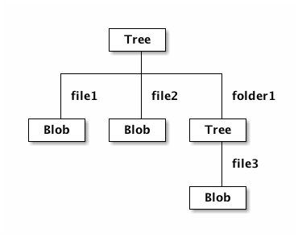

# State of the art

This chapter will describe a few versioning implementations in different kind
of software systems. The most important implementation is Jackrabbit, since
there already is a transport layer for Jackalope and it is an implementation of
the JCR specification, which the solution provided by this theses must also
fulfill.

The second approach to check is the one used by some Product Lifecycle
Management systems. The most important question for this approach is if it also
suits content management, which is the use case JCR and PHPCR was built for.

The last approach is the one used by Git and other version control systems. The
main focus will be on Git, since it gained a lot in popularity in the recent
years. The main question is the same as for PLM systems: Is this approach
suitable for the content management use case?

## Jackrabbit

### General structure

Jackrabbit follows the JCR specification, and therefore implements the basic
structure as described there. Figure 2, taken from the JCR specification, shows
how content is structured in Jackrabbit and any other JCR and PHPCR
implementations. [see @jcr2015a]


The repository is the top element of the content structure. It can consist of
multiple workspaces, and each of the workspaces contain an arbitrary number of
nodes. These nodes have relation to other nodes, so that they can build a
directed acyclic graph. Currently the shareable node feature, which enables a
node to have two parents, is not implemented in Jackalop. This means that it is
only possible to build trees in the PHPCR implementation.

Each node can have several properties, which contain some value. This value can
be a simple scalar, as a number, string or a boolean. These properties are
typed, which is a bit untypical for PHP. It would also be possible to store
images in PHPCR, which means that an export of this content repository would
also contain the required assets for the content.

Each of these properties, but also the nodes, might be attached to a namespace,
which is registered via a URI. The namespace itself is then a prefix splitted
by a colon from the rest of the property's or node's name. By default there is
the `jcr` prefix, which is used for system internal properties and nodes. There
will be examples for this in the versioning section.

The nodes can also have a specific type, which has the capability to define 
some required properties and enable to filter for specific types in the
JCR query language SQL-2. Apart from the primary type of a node the node types
can also be applied as mixins, whereby this may also happen during a node's
lifecycle.

The following code snippet will create a title attribute on the root node
(assuming that the `$session` variable is already correctly initialized):

```php
<?php
$node = $session->getRootNode();
$node->setProperty('title', 'Headline');
$session->save();
```

And the following listing shows the structure of the root node manipulated by
the above code:

```
ROOT:
  - title = Headline
  - jcr:mixinTypes = Array(
      [0] => rep:AccessControllable
    )
  - jcr:primaryType = rep:root
```

The `title` field is the only custom field in this example, containing a simple
string. The other two fields hold some system internals, as it can be seen by
the `jcr` namespace. `jcr:mixinTypes` defines the mixins, which are applied to
this node, and the `jcr:primaryType` contains the single node type.

### Versioning

Enabling versioning for a specific node is done by adding the `mix:versionable`
mixin to it:

```php
<?php
$node->addMixin('mix:versionable');
```

Afterwards the session can deliver an instance of the VersionManager, which
allows to checkout a node for editing and checking in for creating a new
version of the node with the current data:

```php
<?php
$versionManager = $session->getWorkspace()->getVersionManager();
$versionManager->checkout($node->getPath());
$node->setProperty('title', 'New headline');
$session->save();
$versionManager->checkin($node->getPath());
```

After executing these lines there will be two different versions stored in the
system and the root node will look a bit different. It will have a few system
properties more, which contain more information for the versioning mechanism.

```
ROOT:
  - jcr:versionHistory = 
   - : b22346b7-ba4c-41e8-82d8-585ccd5b5d2c
  - title = New headline
  - jcr:predecessors = 
  - jcr:baseVersion = 
   - : 2d073818-92ec-406d-95b5-657981a205ce
  - jcr:uuid = cafebabe-cafe-babe-cafe-babecafebabe
  - jcr:mixinTypes = Array(
      [0] => rep:AccessControllable
      [1] => mix:versionable
    )
  - jcr:primaryType = rep:root
  - jcr:isCheckedOut = 
```

Most of the new properties prefixed by `jcr:` are responsible for holding
versioning information, which will be explained furthermore in the next lines.

The `jcr:versionHistory` property references to another node, containing all
the versioning information about this node, since this node is only holding the
current values. `jcr:predecessors` holds a list of references to all the
previous versions of the node. The latest version of this node is referenced
by `jcr:baseVersion`. Finally the `jcr:isCheckedOut` flag shows us, if the
node is currently checked out, and therefore if it is editable at the moment.

The type properties `jcr:primaryType` and `jcr:mixinTypes` stay almost the
same, the only exception is that the mixin `mix:versionable` is applied to the
node.

The following listing shows the structure of the version history node linked in
the `jcr:versionHistory` property, whereby the less important properties have
been omitted:

```
cafebabe-cafe-babe-cafe-babecafebabe:
  - jcr:uuid = b22346b7-ba4c-41e8-82d8-585ccd5b5d2c
  - jcr:primaryType = nt:versionHistory
  jcr:rootVersion:
    - jcr:predecessors = 
    - jcr:uuid = d9b552fd-bde3-421a-913e-f3c7ccb99664
    - jcr:successors = 
     - : 74b8cbca-074d-45da-b24f-e83cd46bcf77
    - jcr:primaryType = nt:version
    jcr:frozenNode:
      - jcr:frozenUuid = cafebabe-cafe-babe-cafe-babecafebabe
      - jcr:uuid = cb93fc6a-c417-4cca-9998-b500a1c58dfa
      - jcr:primaryType = nt:frozenNode
  1.0:
    - jcr:predecessors = 
     - : d9b552fd-bde3-421a-913e-f3c7ccb99664
    - jcr:uuid = 74b8cbca-074d-45da-b24f-e83cd46bcf77
    - jcr:successors = 
     - : 2d073818-92ec-406d-95b5-657981a205ce
    - jcr:primaryType = nt:version
    jcr:frozenNode:
      - title = Headline
      - jcr:frozenUuid = cafebabe-cafe-babe-cafe-babecafebabe
      - jcr:uuid = e874032d-208a-44f5-a431-9fc24215fbbc
      - jcr:primaryType = nt:frozenNode
  1.1:
    - jcr:predecessors = 
     - : 74b8cbca-074d-45da-b24f-e83cd46bcf77
    - jcr:uuid = 2d073818-92ec-406d-95b5-657981a205ce
    - jcr:successors = 
    - jcr:primaryType = nt:version
    jcr:frozenNode:
      - title = New headline
      - jcr:frozenUuid = cafebabe-cafe-babe-cafe-babecafebabe
      - jcr:uuid = ce0a48f5-1ffd-474d-bc09-81fffa25d829
      - jcr:primaryType = nt:frozenNode
```

This node is located in the `jcr:system` node, which is a direct descendant of
the root node. Its main purpose is to hold all the values from the different
versions. The different versions in this example are the `jcr:rootVersion`,
which contains the first version of the node, as well as the two later versions
`1.0` and `1.1`. The naming of the versions is automatically decided by
jackrabbit.

All of these three nodes have a common structure. In this example they are
connected via a doubled linked list, built with the `jcr:predecessors` and
`jcr:succesors` properties. Since both of these properties are an array it is
also possible to build multiple branches, resulting in a directed acyclic graph
instead of a tree. They also have the primary type `nt:version` in common, as
well as a subnode called `jcr:frozenNode`. The structure of this frozen node
can now differ a lot, except for some of the already described system
properties, which are prefixed with `jcr:frozen`. This simply means that they
are holding a frozen state, from a moment in the past. Additionally these nodes
contain all the custom properties defined by the user, as in this example the
`title` attribute.

An advantage of this approach is, that it is built inside of the content
structure from JCR. So it would probably be possible to implement this without
touching the current schema of Jackalope Doctrine DBAL and even without
implementing something that is unique to Doctrine DBAL at all. This means it
would be possible to implement this feature in a transport agnostig way
resulting in the availability of versioning in not only Doctrine DBAL, but in
all current and future transport layers.

## PLM

## Version Control Systems

In this chapter the mechanisms of version control systems in general and
especially of git are discussed.

### General

Version or revision control in general tries to manage the changes of data.
There are different use cases where version control can be applied, whereby
versioning content of a CMS is the most important one for this thesis. But it
is also a very important for documents and books or computer programs, which
are probably the most complicated use case, since in a modern version control
system many developer should be able to edit the same file at the same time.

A term that all of these systems share is the unique revision number, but how
this number is built differs from system to system. Possible ways to generate
such a number are using an incremental system or generating a unique hash.
Usually the revision also contains a timestamp and the creator identified by
an email adress or some other unique identifier.


Version control systems exist in different variations. Figure 3 shows the
easiest way possible, which is to just track a linear version history. This is
sufficient for documents on which only a single person at a time is working
and is widely used on some homepages and word processors. Aside from tracking
the changes on a specific document this system also allows the user to revert
the document to a previous version, which is a very basic functionality for
such a system. [see @wikipedia2015a]


More advanced version control systems offer the possibility to manage
non-linear histories as shown in figure 4. Usually these operations are called
branching for creating a new path in the version history and merging for the
reunion of multiple branches. This functionality is very important if multiple
persons are working on the same data set, since it enables many different
states of the same document or project.

There are two big groups of version control systems. On the one side there are
centralized systems holding the metadata on a central server, and on the other
side there are decentralized systems. [see @raymond2015a] The latter differ
from the first in the way developers interact with each other. So has every
user in a decentralized system his own copy of the metadata, which enables them
to work asynchronously. Therfore the work has to be integrated to each other
state from time to time.

### Git

For a more concrete insight in version control systems this chapter delivers a
deeper insight into git. This system was chosen because it extremely grew in
popularity - especially in the open source community - over the last few years.
[see @dzone2014a] But it also seems to gain more and more attention in the
field of professional software developement.
[see @itjobswatch2015a; @itjobswatch2015b]

On its very core git is a content-addressable file system, which the official
git book describes as a simple key-value store. [see @git2015a]
Content-addressable means that the key for a specific value can be determined
from its content. One of git's most fundamental function is a cryptographic
hash function, which uses a SHA1 to generate a key for the key-value store.
This key is used for all kind of objects managed by git. Another advantage of
this approach is that an object can automatically be identified as broken if
its SHA1 hash doesn't match its key.[see @otte2009a, p. 9]

Git addresses 4 different types of objects. The one holding the actual content
of the files under version control are the BLOBs (stands for binary large
object). Consider that this type is holding only the content of the file, but
not additional information like the name of the file. This kind of information
is kept in the tree objects, which are containing pointers to other git objects
together with some names. A tree can also contain another tree.



Figure 5 shows this structure, which is quite similar to a filesystem. The tree
object represents a folder and the blob objects the content of the files.
Another important note is that the tree objects can be reused multiple times.
This way disk space can be saved, since trees without any changes don't need to
be created another time.

The internal representation of such a tree object looks like the following:

```
100644 blob a0054e492840f572e48a3cb791d2e083afaf08f6    file1
100644 blob 4d4bc1c77f63bd5429cb0ab4d74cb8729570d293    file2
040000 tree 8e98f995b37c9c648a5f55fb0a41de9f4e20c26e    folder1
```

The first number contains some access information, the second column contains
the type of the referenced object, then comes the key of the referenced git
object, and the last column defines the name of the reference.

Such a tree is the target of a commit. The commit specifies a certain state of
revision. Therefore it adds more information to a tree. A commit consists of a
pointer to a specific tree, which can be considered as frozen, and adds
information about the author. Actually git distinguishes between the author and
the commiter. The author is the original editor of the content, whereby the
commiter is the one who added the code to version control. In many use cases
these two roles are taken by the same person.

Tags enables git users to give certain levels of developments a better name
than a SHA-1 hash. It is quite similar to a commit, it contains a tagger, a
date, a message, and a pointer, whereby the pointer shows to a commit instead
of a tree.

The structure can be compared to the one from jackrabbit, especially the part
with the frozen nodes, since git also does not save the changes since the last
commit, but keeps a frozen version of the state, except for older commits. For
these git is doing a garbage collection, which will be packed into packages
with an index, to find also old content in a acceptable amount of time, without
taking too much space.

