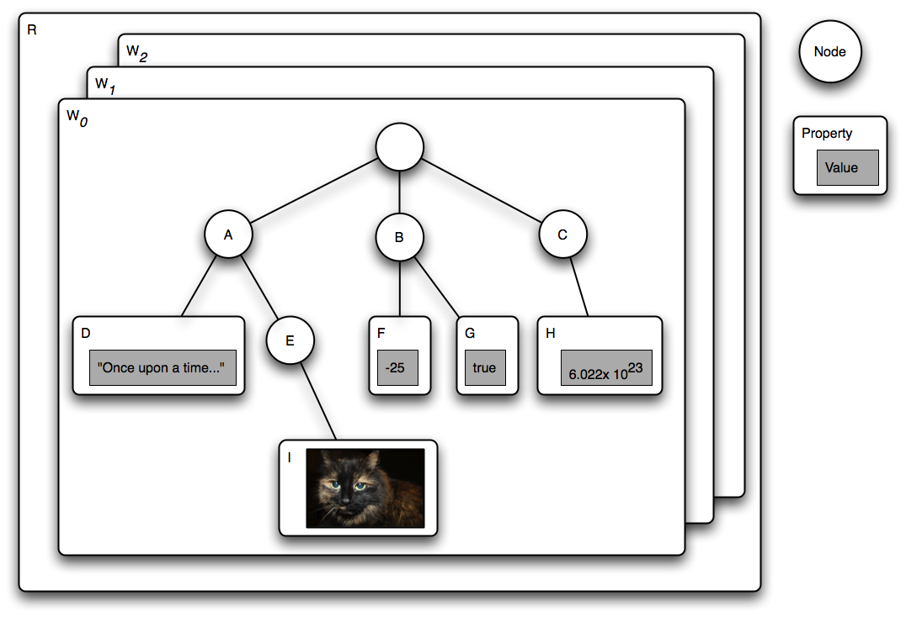

# State of the art

This chapter will describe a few versioning implementations in different kind
of software systems. The most important implementation is Jackrabbit, since
there already is a transport layer for Jackalope and it is an implementation of
the JCR specification, which the solution provided by this theses must also
fulfill.

The second approach to check is the one used by some Product Lifecycle
Management systems. The most important question for this approach is if it also
suits content management, which is the use case JCR and PHPCR was built for.

The last approach is the one used by Git and other version control systems. The
main focus will be on Git, since it gained a lot in popularity in the recent
years. The main question is the same as for PLM systems: Is this approach
suitable for the content management use case?

## Jackrabbit

### General structure

Jackrabbit follows the JCR specification, and therefore implements the basic
structure as described there. Figure 2, taken from the JCR specification, shows
how content is structured in Jackrabbit and any other JCR and PHPCR
implementations. [see @jcr2015a]



As you can see the repository is the top element of the content structure. It
can consist of multiple workspaces, and each of the workspaces contain an
arbitrary number of nodes. These nodes have relation to other nodes, so that
they can build a directed acyclic graph. Currently the shareable node feature,
which enables a node to have two parents, is not implemented in Jackalop. This
means that it is only possible to build trees in the PHPCR implementation.

Each node can have several properties, which contain some value. This value can
be a simple scalar, as a number, string or a boolean. These properties are
typed, which is a bit untypical for PHP. As you can see in figure 2 it would
also be possible to store images in PHPCR, which means that an export of this
content repository would also contain the required assets for the content.

Each of these properties, but also the nodes, might be attached to a namespace,
which is registered via a URI. The namespace itself is then a prefix splitted
by a colon from the rest of the property's or node's name. By default there is
the `jcr` prefix, which is used for system internal properties and nodes. There
will be examples for this in the versioning section.

The nodes can also have a specific type, which has the capability to define 
some required properties and enable to filter for specific types in the
JCR query language SQL-2. Apart from the primary type of a node the node types
can also be applied as mixins, whereby this may also happen during a node's
lifecycle.

The following code snippet will create a title attribute on the root node
(assuming that the `$session` variable is already correctly initialized):

```php
<?php
$node = $session->getRootNode();
$node->setProperty('title', 'Headline');
$session->save();
```

And the following listing shows the structure of the root node manipulated by
the above code:

```
ROOT:
  - title = Headline
  - jcr:mixinTypes = Array(
      [0] => rep:AccessControllable
    )
  - jcr:primaryType = rep:root
```

The `title` field is the only custom field in this example, containing a simple
string. The other two fields hold some system internals, as it can be seen by
the `jcr` namespace. `jcr:mixinTypes` defines the mixins, which are applied to
this node, and the `jcr:primaryType` contains the single node type.

### Versioning

If somebody wants to add versioning capabilities to a node, he has to add the
mixin `mix:versionable` to the node:

```php
<?php
$node->addMixin('mix:versionable');
```

Afterwards the session can deliver an instance of the VersionManager, which
allows to checkout a node for editing and checking in for creating a new
version of the node with the current data:

```php
<?php
$versionManager = $session->getWorkspace()->getVersionManager();
$versionManager->checkout($node->getPath());
$node->setProperty('title', 'New headline');
$session->save();
$versionManager->checkin($node->getPath());
```

After executing these lines there will be two different versions stored in the
system and the root node will look a bit different. It will have a few system
properties more, which contain more information for the versioning mechanism.

```
ROOT:
  - jcr:versionHistory = 
   - : b22346b7-ba4c-41e8-82d8-585ccd5b5d2c
  - title = New headline
  - jcr:predecessors = 
  - jcr:baseVersion = 
   - : 2d073818-92ec-406d-95b5-657981a205ce
  - jcr:uuid = cafebabe-cafe-babe-cafe-babecafebabe
  - jcr:mixinTypes = Array(
      [0] => rep:AccessControllable
      [1] => mix:versionable
    )
  - jcr:primaryType = rep:root
  - jcr:isCheckedOut = 
```

Most of the new properties prefixed by `jcr:` are responsible for holding
versioning information, which will be explained furthermore in the next lines.

The `jcr:versionHistory` property references to another node, containing all
the versioning information about this node, since this node is only holding the
current values. `jcr:predecessors` holds a list of references to all the
previous versions of the node. The latest version of this node is referenced
by `jcr:baseVersion`. Finally the `jcr:isCheckedOut` flag shows us, if the
node is currently checked out, and therefore if it is editable at the moment.

The type properties `jcr:primaryType` and `jcr:mixinTypes` stay almost the
same, the only exception is that the mixin `mix:versionable` is applied to the
node.

The following listing shows the structure of the version history node linked in
the `jcr:versionHistory` property, whereby the less important properties have
been omitted:

```
cafebabe-cafe-babe-cafe-babecafebabe:
  - jcr:uuid = b22346b7-ba4c-41e8-82d8-585ccd5b5d2c
  - jcr:primaryType = nt:versionHistory
  jcr:rootVersion:
    - jcr:predecessors = 
    - jcr:uuid = d9b552fd-bde3-421a-913e-f3c7ccb99664
    - jcr:successors = 
     - : 74b8cbca-074d-45da-b24f-e83cd46bcf77
    - jcr:primaryType = nt:version
    jcr:frozenNode:
      - jcr:frozenUuid = cafebabe-cafe-babe-cafe-babecafebabe
      - jcr:uuid = cb93fc6a-c417-4cca-9998-b500a1c58dfa
      - jcr:primaryType = nt:frozenNode
  1.0:
    - jcr:predecessors = 
     - : d9b552fd-bde3-421a-913e-f3c7ccb99664
    - jcr:uuid = 74b8cbca-074d-45da-b24f-e83cd46bcf77
    - jcr:successors = 
     - : 2d073818-92ec-406d-95b5-657981a205ce
    - jcr:primaryType = nt:version
    jcr:frozenNode:
      - title = Headline
      - jcr:frozenUuid = cafebabe-cafe-babe-cafe-babecafebabe
      - jcr:uuid = e874032d-208a-44f5-a431-9fc24215fbbc
      - jcr:primaryType = nt:frozenNode
  1.1:
    - jcr:predecessors = 
     - : 74b8cbca-074d-45da-b24f-e83cd46bcf77
    - jcr:uuid = 2d073818-92ec-406d-95b5-657981a205ce
    - jcr:successors = 
    - jcr:primaryType = nt:version
    jcr:frozenNode:
      - title = New headline
      - jcr:frozenUuid = cafebabe-cafe-babe-cafe-babecafebabe
      - jcr:uuid = ce0a48f5-1ffd-474d-bc09-81fffa25d829
      - jcr:primaryType = nt:frozenNode
```

This node is located in the `jcr:system` node, which is a direct descendant of
the root node. Its main purpose is to hold all the values from the different
versions. The different versions in this example are the `jcr:rootVersion`,
which contains the first version of the node, as well as the two later versions
`1.0` and `1.1`. The naming of the versions is automatically decided by
jackrabbit.

All of these three nodes have a common structure. In this example they are
connected via a doubled linked list, built with the `jcr:predecessors` and
`jcr:succesors` properties. Since both of these properties are an array it is
also possible to build multiple branches, resulting in a directed acyclic graph
instead of a tree. The also have the primary type `nt:version` in common, as
well as a subnode called `jcr:frozenNode`. The structure of this frozen node
can now differ a lot, except for some of the already described system
properties, which are prefixed with `jcr:frozen`. This simply means that they
are holding a frozen state, from a moment in the past. Additionally these nodes
contain all the custom properties defined by the user, as in this example the
`title` attribute.

An advantage of this approach is, that it is built inside of the content
structure from JCR. So it would probably be possible to implement this without
touching the current schema of Jackalope Doctrine DBAL.

## PLM

## Version Control Systems

### General

### Git
