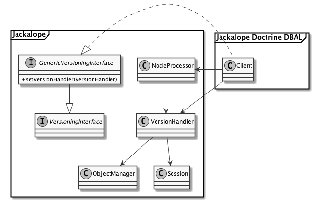

# Implementation

This chapter will explain the main task of this thesis - implementing
versioning in the Doctrine DBAL transport layer of jackalope. 

## Structure

The project is split into many different git repositories. The next sections
will explain each of the repositories, on which work has been done, in order to
complete the goal of implementing versioning for the doctrine dbal transport
layer.

### Jackalope

The Jackalope repository [^13] contains all the code not being coupled to any
specific transport layer. So many implementation details of the JCR
specification have already been implemented in this repository in a storage
agnostic way. The only part which is delegated to one of the transport layers
is the storage.

In this repository the `VersionHandler` implementing a general approach of
versioning valid for all different transport layers. There was also the need
for some refactoring to enable certain operations required for the verisoning
support in other transport layers than Jackrabbit.

### Jackalope Doctrine DBAL

Since the Doctrine DBAL transport layer [^14] is the layer of choice for this
thesis, it also had to be touched in order to enable versioning. Its `Client`
class enables the single features described in the specification and functions
as a proxy between the actual storage and the Jackalope. The
`ImplementationLoader` describes which (hopefully successful) tests should be
executed on a test run.

The main parts to work on in this repository were the correct initialization of
the tests and implementing the methods for versioning on the client. These
methods just delegate these tasks to the `VersionHandler` implemented in
Jackalope.

### PHPCR Utils

The PHPCR Utils repository [^15] contains a set of helper classes, which might
be useful to use in combination with the PHPCR interface. The scope of these
classes vary quite a lot, it contains e.g. some value convertions, a helper for
creating UUID and some commands for execution on the command line.

However, since Jackrabbit was the only implementation for some time, there has
been some code in this repository which should actually have been targeted
solely on Jackrabbit. This code was causing issues with the Doctrine DBAL
transport layer and had also to be refactored.

### PHPCR API Tests

The PHPCR API Tests repository [^16] holds all the tests a PHPCR implementation
has to successfully implement. It can be installed together with Jackalope, if
a developer wants to check an implementation against the PHPCR standard.

The same issue as for the PHPCR Utils apply to this repository. Originally
Jackalope concentrated on the Jackrabbit transport layer, but it utters in a
different way. There was no wrong code in this repository, but there were some
missing tests, because the author relied on Jackrabbit's functionality for a
few tasks. Especially the tests for restoring a version and all the possible
edge cases had to be added.

## Design considerations

JCR defines the way the versioning has to be implemented in a content
repository. Since all the metadata for versioning is also stored in nodes and
properties it is not necessary to implement this in a storage specific way.

Figure 9 shows the general architecture, which has been chosen to implement
versioning in Jackalope.

We decided to implement a `VersionHandler`, which takes care of versioning in
the content repository context. But instead of just using it as a default it is
designed to be plugged into a transport layer. This is possible via an
interface check. So every `Client`, which is the name of the class describing
the transport layer, using the `VersionHandler` has to additionally implement
the `GenericVersioningInterface`.

Another important interface for this thesis is the `VersioningInterface`, which
defines the required methods for the `Client` to support Versioning. If the
`VersionHandler` of this thesis is used, these methods only delegate to the
corresponding method in the `VersionHandler`. The `GenericVersioningInterface`
also extends this `VersioningInterface`, because the use of the
`VersionHandler` also assumes that the `VersioningInterface` is used. This way
the `Client` only has to implement one instead of two interfaces.

The `GenericVersioningInterface` also forces the developer to implement a
`setVersionHandler` method. This method is required in order to pass the
`VersionHandler` to the `Client` class via setter injection. Only if this has
been done the `Client` is able to pass all the versioning mechanisms directly
to the `VersionHandler`.

In order to be able to do its work, the `VersionHandler` needs two other
objects. The `Session` object is returned when the user logs into a repository.
It is the central object for working with the repository and allows to
manipulate the data in it. Therefore it works close together with the second
class the `VersionHandler` uses, which is the `ObjectManager`. This class acts
as mediator between the `Session` and the transport layer's `Client` and as a
Unit of Work, which means that it knows about the state of each node and thus
what has to be saved using the transport layer. Furthermore it acts as a cache
in front of the transport layer having an important influence on performance.

The `VersionHandler` has to use these two classes since it is storing the
versioning information in the nodes and properties specified by JCR. This is
also the reason the versioning have not to be implemented separately for each
transport layer. The `ObjectManager` can easily be used to abstract this
knowledge away from this implementation.

This design was mainly driven by the fact that other transport layers might be
able to do certain operations in a more performance optimized way, e.g. for the
jackrabbit transport layer none of this logic has to be used, because the
database is already capable of handling versioning. The generic
`VersionHandler` will follow the specification in a very strict way, so that it
is garuanteed to work in every imaginable transport layer following the JCR
specification.

## Test setup

## Realization

### Initialization of mixin

### Checkin and checkout

#### Creating a frozen node

### Write protection

### Delete a version

### Restore a version

[^13]: <https://github.com/jackalope/jackalope>
[^14]: <https://github.com/jackalope/jackalope-doctrine-dbal>
[^15]: <https://github.com/phpcr/phpcr-utils>
[^16]: <https://github.com/phpcr/phpcr-api-tests>
