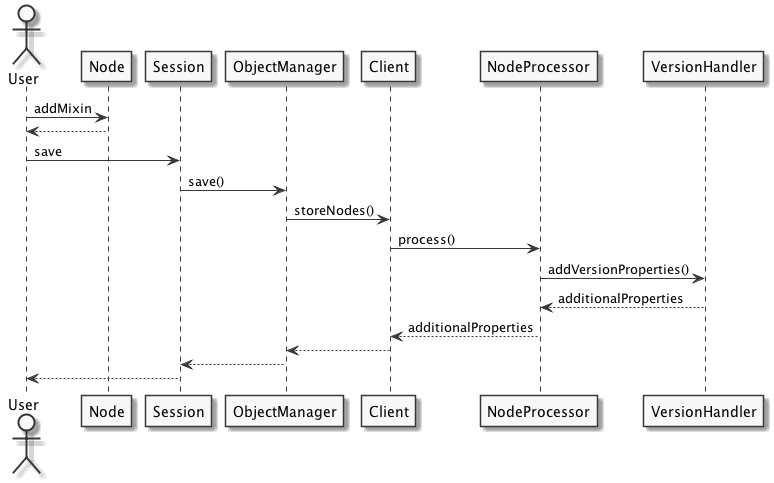

# Implementation

This chapter will explain how versioning in the Doctrine DBAL transport layer
of jackalope was implemented.

## Structure

The project is split into many different git repositories. The next sections
will explain each of the repositories, on which work has been done, in order to
complete the goal of implementing versioning for the doctrine dbal transport
layer.

### Jackalope

The Jackalope repository [^13] contains all the code not being coupled to any
specific transport layer. So many implementation details of the JCR
specification have already been implemented in this repository in a storage
agnostic way. Because of this storage agnostic implementation the only part
which has to be delegated to one of the transport layers is the actual storage
of the structure in some persistent memory. Since this is handled differently
in every storage (e.g. SQL in relational databases, WebDAV in combination with
Jackrabbit, some kind of serialization if the data is saved on disk in simple
files) it cannot be handled in the storage agnostic part of Jackalope.

In this repository the `VersionHandler` implements a general approach of
versioning valid for all different transport layers. There was also the need
for some refactoring to enable certain operations required for the versioning
support in other transport layers than Jackrabbit.

### Jackalope Doctrine DBAL

Since the Doctrine DBAL transport layer [^14] is the layer of choice for this
thesis, it also had to be touched in order to enable versioning. Its `Client`
class enables the single features described in the specification and functions
as a proxy between the actual storage and the Jackalope. The
`ImplementationLoader` describes which (hopefully successful) tests should be
executed on a test run.

The main parts to work on in this repository were the correct initialization of
the tests and implementing the methods for versioning on the client. These
methods just delegate these tasks to the `VersionHandler` implemented in
Jackalope.

### PHPCR Utils

The PHPCR Utils repository [^15] contains a set of helper classes, which might
be useful to be used in combination with the PHPCR interface. The scope of
these classes vary quite a lot. For example it contains some value converters,
a helper for creating UUID and some commands for execution on the command line.

However, since Jackrabbit was the only implementation for some time, there has
been some code in this repository which should actually have been targeted
solely on Jackrabbit. This code was causing issues with the Doctrine DBAL
transport layer and had also to be refactored.

### PHPCR API Tests

The PHPCR API Tests repository [^16] holds all the tests a PHPCR implementation
has to successfully implement. It can be installed together with Jackalope, if
a developer wants to check an implementation against the PHPCR standard.

The same issue as for the PHPCR Utils apply to this repository. Originally
Jackalope concentrated on the Jackrabbit transport layer, but it is affecting
this repository in a different way. There was no wrong code in this repository,
but there were some missing tests, because the author relied on Jackrabbit's
functionality for a few tasks. Especially the tests for restoring a version and
all the possible edge cases had to be added.

## Design considerations

JCR defines the way the versioning has to be implemented in a content
repository. Since all the metadata for versioning is also stored in nodes and
properties it is not necessary to implement this in a storage specific way.

Figure 9 shows the general architecture, which has been chosen to implement
versioning in Jackalope.


We decided to implement a `VersionHandler`, which takes care of versioning in
the content repository context. But instead of just using it as a default it is
designed to be plugged into a transport layer. This is possible via an
interface check. So every `Client`, which is the name of the class describing
the transport layer, using the `VersionHandler` has to additionally implement
the `GenericVersioningInterface`.

Another important interface for this thesis is the `VersioningInterface`, which
defines the required methods for the `Client` to support versioning. If the
`VersionHandler` of this thesis is used, these methods only delegate to the
corresponding method in the `VersionHandler`. The `GenericVersioningInterface`
also extends this `VersioningInterface`, because the use of the
`VersionHandler` also assumes that the `VersioningInterface` is used. This way
the `Client` only has to implement one instead of two interfaces.

The `GenericVersioningInterface` also forces the developer to implement a
`setVersionHandler` method. This method is required in order to pass the
`VersionHandler` to the `Client` class via setter injection. Only if this has
been done the `Client` is able to pass all the versioning mechanisms directly
to the `VersionHandler`.

In order to be able to do its work, the `VersionHandler` needs two other
objects. The `Session` object is returned when the user logs into a repository.
It is the central object for working with the repository and allows to
manipulate the data in it. Therefore it works closely together with the second
class the `VersionHandler` uses, which is the `ObjectManager`. This class acts
as mediator between the `Session` and the transport layer's `Client` and as a
Unit of Work, which means that it knows about the state of each node and thus
what has to be saved using the transport layer. Furthermore it acts as a cache
in front of the transport layer having an important influence on performance.

The `VersionHandler` has to use these two classes since it is storing the
versioning information in the nodes and properties specified by JCR. For this
reason the versioning functionality can be implemented in isoliation of the 
transport layer. The `ObjectManager` can easily be used to abstract this
knowledge away from this implementation.

This design was mainly driven by the fact that other transport layers might be
able to do certain operations in a more performance optimized way, e.g. for the
jackrabbit transport layer none of this logic has to be used, because the
database is already capable of handling versioning. The generic
`VersionHandler` will follow the specification in a very strict way, so that it
is garuanteed to work in every imaginable transport layer following the JCR
specification.

## Test setup

### General

The most important piece of software for testing in PHP is PHPUnit[^17]. It's
an implementation of xUnit for PHP, which is a collective name for the shared
architecture of testing frameworks across all major programming languages. The
architecture was introduced by Kent Beck with SUnit for SmallTalk, and the best
known implementation today is JUnit for Java. [see @fowler2006]

The PHPCR API tests are implemented in PHPUnit. This repository contains, among
others, two very important directores. The first one is the `fixtures`
directory offering the sample data for the tests. This data is organized in XML
files, which can easily be used to create a certain database setup for a given
test. The second directory called `tests` consists of the actual PHPUnit test
cases. Both directories are structured using sub directories named after the
chapters in the JCR specification.

The JCR specification defines a lot of different requirements in different
chapters. Since it is not possible to support all these requirements from the
beginning, there has to be an easy way for the implementation to define which
tests are supported, and therefore should be executed. Otherwise it would be
hard to do test driven development supported by continous integration, since
the currently not implemented features would always break the build. Figure 10
shows how this is achieved.


The `ImplementationLoader` is the class defining which specification chapters
or even single tests are supported by the concrete implementation, and
therefore is located in the concrete implementation's repository. The concrete
implementation must also deliver a `bootstrap.php` file, which is responsible
for declaring the `ImplementationLoader` class in the global namespace.

This `ImplementationLoader` inherits from the `AbstractLoader`, which
introduces some variables containing the unsupported chapters (from the jcr
specification) test cases and even single tests. The `AbstractLoader`
implements the method `getSupportedTest($chapter, $case, $name)`, which will
return a boolean value indicating if the test is supported.

The `BaseCase` inherits from the `PHPUnit_Framework_TestCase`, so that it can
be run using PHPUnit. Additionally it already offers an implementation of the
`setUpBeforeClass` method being executed before the test case, where it gets an
instance of the `ImplementationLoader`. This instance will then be used to
detect if the current test is supported by the current implementation in the
`setUp` method, which is called before every single test by PHPUnit. The
`markTestSkipped` method of PHPUnit is used to skip this test.

With this setup it is also possible to use a continous integration service to
see if the current state of development works as expected, since the not
supported features will not break the build. For Jackalope Doctrine DBAL the
service TravisCI[^18] is used for that, which is also the reason for the
necessity of such an test architecture.

### Doctrine DBAL Transport Layer

The tests for the implementation of the Doctrine DBAL Transport Layer are even
a bit more special, since Doctrine DBAL supports multiple databases. So the
bootstrapping has to identify the database used and, depending on the
database, to inject the correct connection parameters. Since TravisCI should
automatically test against MySQL and PostgreSQL for every change submitted
to GitHub via a Pull Request, there is also the need of a script generating
the correct config based on an environment variable. This script located in the
`tests` directory of the Jackalope Doctrine DBAL repository generates a config
file adapted for the database used before each build on TravisCI.

## Realization

This section will address the specifics of the implementation, based on the
previous thoughts. It also contains some details of the implementation.

### Initialization of mixin

The specification already describes the actions to take in order to make a node
a versionable node. The actions are quite straight forward, you have to add a
`jcr:isCheckedOut` property, which indicates if a node is checked out and
therefore allows for modification, the node requires a `VersionHistory` object
and some more references like the successors, predecessors and a base version.

The scope of this functionality is quite manageable, but the real issue is
where to do this in the existing architecture. There are two specific problems
coming to mind:

- Nodes must be created and immediately referenced within the same transaction.
- The action has to happen on the very scoped method call `addMixin`.

The first point is a purely technical issue, because it is not easily possible
to reference a node which has not been written to the database yet. The second
one is an architectural decision. Since the `addMixin` method is a very small
method and should stay this way, it would not be good design to just put the
logic of initializing versioning attributes into this method.

Fortunately the `NodeProcessor` class was already created when the validation
of node types has been moved from Jackalope Doctrine DBAL to Jackalope. This
solves both of the mentioned issues, since the `NodeProcessor` is responsible
for validating existing properties on the node, automatically generating the
properties as described in the definition of the node type and adding new nodes
to the system if required.



Figure 11 shows how this action is processed. The user calls `addMixin` on the
node, which just adds an additional entry in an array of used mixins. Also the
properties which need to be created for the versioning are not existing after
this call.

This happens when the user calls the actual `save` method from the `Session`,
which will actually save the changes persistently. The above figure is not a
complete diagram, because only the important method calls are shown.

The `Session` then calls the `save` method of the `ObjectManager` and wraps it
with the transaction handling. The `ObjectManager` uses the `Client` of the
transport layer to actually save the data to some persistent memory and adds
caching of nodes. The important method call is the `storeNodes` function, in
which the `NodeProcessor` is used. 

The `NodeProcessor` uses the node types being registered in the system to
validate and eventually auto create the system based on the node type's
definitions. The important method for the versioning is called
`processNodeWithType`, which checks and auto creates properties and child nodes
for a single node type. For the child nodes it maintains a variable called
`$additionalOperations`, in which operations like adding, removing or moving a
node are collected, so that they can be treated later all together. That might
even be necessary for some cases, because of some integrity checks.

The `processNodeWithType` method had to be extended as shown in the following
listing.

```php
private function processNodeWithType(
    NodeInterface $node,
    NodeType $nodeTypeDefinition
) {
    // ...
    if ($nodeTypeDefinition->isNodeType(
        VersionHandler::MIX_SIMPLE_VERSIONABLE
    )) {
        $additionalOperations = $this->versionHandler
            ->addVersionProperties($node);
    }
    // ...
}
```

So the node is passed to the `VersionHandler`, so that it can create the
required properties and nodes. For the new nodes in the `jcr:system` subtree
the `addVersionProperties` returns these additional operations. The next
listing shows a bit of this logic.

```php
public function addVersionProperties(NodeInterface $node)
{
    if ($node->hasProperty('jcr:isCheckedOut')) {
        // Versioning properties have already been initialized
        // nothing to do
        return array();
    }

    $additionalOperations = array();
    
    // ...

    $versionStorageNode = $session
        ->getNode('/jcr:system/jcr:versionStorage');
    $versionHistory = $versionStorageNode
        ->addNode($node->getIdentifier(), 'nt:versionHistory');
    $versionHistory
        ->setProperty('jcr:uuid', UUIDHelper::generateUUID());
    $versionHistory
        ->setProperty('jcr:versionableUuid', $node->getIdentifier());
    $additionalOperations[] = new AddNodeOperation(
        $versionHistory->getPath(),
        $versionHistory
    );

    // ...

    $node->setProperty('jcr:versionHistory', $versionHistory);

    // ...

    return $additionalOperations;
}
```

First of all the method will check if the `jcr:isCheckedOut` propertiy already
exists. If it does it will assume that this method have already be called for
this node, and it does not have to do anything. Then the `VersionHistory` node
is created, in which all the versioning information for this specific node is
kept. The new node is added to the list of additional operations, so that it
can be executed later together with all the other additional operations.

There has also a trick to be applied in order to make this work. If a new node
is created and immediately referenced, it will result in an exception claiming
that the new node cannot be referenced, because it has no UUID yet. The node
will get the UUID from the system right after the data has been saved to the
database, so one possibility would be to call the `save` method from the
`Session` in between, but this would be no clean design and would perform
worse. So to avoid this technical limitation the UUID is set on the node
explicitly, so the `setProperty` call works with the node without throwing an
exception.

### Checkin

The checkin and checkout method of the `VersionManager` are probably the most
common point of contact with the users of Jackalope. Therefore they are defined
in the `VersionManagerInterface` of PHPCR, so that different implementations
can be used exchangeable. Figure 12 shows this interface and the structure of
the other classes interacting with it.


The `VersionManager` has a quite similar role as the `ObjectManager`. It
already implements the parts of the specification, which can be done
independent of the underlying storage. However, it uses the `ObjectManager` to
pass the required information to the transport layer.


Since the node is initially checked out, the `checkin` method will be explained
first. The general workflow is that the developer retrieves the 
`VersionManager` from the workspace, which can be gained from the `Session`.
Afterwards the developer can use the `checkin` method, passing the path of the
node, to create a new version of the node. 

As Figure 13 shows the `checkin` method is already doing some work as specified
in JCR. So the first step it takes is to get the node for which a new version
should be created and checks if it is modified. If it is modified this
operation is illegal to the specification and the `VersionManager` will throw
an `InvalidItemStateException` as specified.

After this initial check the method call is just passed to the `Client` via 
the `ObjectManager`. As described in the chapter about the design
considerations the `Client` implements the `VersioningInterface`, but these
methods just delegate the call to the `VersionHandler`, which is reusable
across all different transport layers. The result of this call will be the path
to the latest version.

The `VersionHandler` has to retrieve the node by the given path again, which
might look like a big overhead, but since the `ObjectManager` caches the values
retrieved from the transport layer the performance loss is not significant.
The next step is to check if the node is versionable, which is shown in the
next listing.

```php
$node = $this->objectManager->getNodeByPath($path);

if (!$node->isNodeType(static::MIX_SIMPLE_VERSIONABLE)) {
    throw new UnsupportedRepositoryOperationException(
        'Node has to implement at least "mix:simpleVersionable"'
    );
}
```

The check for the simple versioning mixin is enough, since this is just about
a, as the name suggests, simpler versioning mechanism. The mixin for full
versioning inherits from the simple versioning mixin, so this check works for
both kinds of versioning. If the node the user wants to checkin has none of
these mixins, this indicates that the node is not versionable, and therefore
an `UnsupportedRepositoryOperationException` as specified in JCR is thrown.

The next check will see if the node is not checkout out, which would mean that
there can't be any changes on this node since the last checkin. Thus, there
should not be a new version created, since it would be identical to the
previous one. In this case the specification says that the path of the current
base version should be returned. The base version is a version in the version
history of the node, which will be used as the next immediate predecessor for
the next version. [see @jcr2015b]

There is also already a check for failed merges included, which will currently
not apply, since merging different versions is not implemented yet. It only
checks if it has a `jcr:mergeFailed` property, and throws a `VersionException`
in case there is. If this happens the application using Jackalope has to resolve
this merge conflict on its own, there are no automatic merge conflict resolvers
like the different 3-way merges in git.[^19] The only automatic merge which
will apply is not a real merge, just a fast forward, which means the common
ancestor is the base version of one of both version paths.

After these checks the actual action of the checkin procedure is taken, whereby
creating the frozen node, which will freeze the current state of the node to an
own persistent node, is the crucial part. But before that the version node
holding this frozen node has to be created as a child of the `VersionHistory`
of the node. The node itself knows its `VersionHistory` because the reference
to it is saved in its `jcr:versionHistory` property. The new node containing
the version will then be created with the `jcr:created` property containing the
date the version was created and an empty `jcr:successors` property, since a
new node will not have successors immediately. It will also be instantiated
with a UUID, because there is the same issue with immediately referencing the
node as in the initializiation of the versioning capabilities of the node.

Subsequently the frozen node will be created. It will be created using the node
type `nt:frozenNode`, which means the properties `jcr:frozenUuid`,
`jcr:frozenPrimaryType` and `jcr:frozenMixinTypes`. These properties are filled
with the values from the corresponding properties in the node (without the
"frozen" part of course). Then all the properties from the node are iterated,
and copied to the frozen node, but before they are copied there will be two
checks which might cause them to be omitted. The following listing shows the
code for this purpose.

```php
foreach ($node->getProperties() as $property) {
    /** @var PropertyInterface $property */
    $propertyName = $property->getName();
    if ($propertyName == 'jcr:primaryType'
        || $propertyName == 'jcr:mixinTypes'
        || $propertyName == 'jcr:uuid'
    ) {
        continue;
    }

    $onParentVersion = $property->getDefinition()
        ->getOnParentVersion();
    if ($onParentVersion != OnParentVersionAction::COPY
        && $onParentVersion != OnParentVersionAction::VERSION
    ) {
        continue;
    }

    $frozenNode->setProperty(
        $propertyName,
        $property->getValue()
    );
}
```

The first check is to see if it is one of the fields that have already been
copied to one of the frozen fields. This is necessary because the version node
needs its own UUID and types. Secondly the value of the node type's
`onParentVersion` attribute determines how the property is stored in the frozen
node. This value describes how properties and children of the node to version
should be handled. For the properties only a `onParentVersion` of `COPY` and
`VERSION` is of importance. This means that for these two values the property
is copied to the frozen node, otherwise they will be omitted.

In a second loop all the child nodes of the node to version are handled. The
loop looks quite similiar, but contains a recursive function call for copying
all the properties and child nodes. The child nodes are affected more than the
properties by its `onParentVersion` attributes. Namely it would copy the child
node with its entire subgraph on an `onParentVersion` attribute of `COPY`
(regardless of the other `onParentVersion` values) and just put a reference
to the node's `VersionHistory` in case of an `onParentVersion` attribute of
`VERSION`. However, this is not implemented for the child nodes in Jackalope
Doctrine DBAL yet. At the moment simply every single node is copied, without a
check of its `onParentVersion` attribute.

After the frozen node has been created the references and states of the other
nodes are adjusted due to the new version. So the new version is set as the
successor of the currently existing base version and as predecessor of the
actual node. Then the `jcr:successors` property of the new version is set to an
empty array, since the new version cannot have any successors yet. Afterwards
the new version gets added to successors of all its predecessors, so that a
correct double linked list is maintained.

At the end the `jcr:isCheckedOut` flag is set to false again, to indicate that
this node is currently representing a version and not editable before it is
checked out again. The path of the new version node is returned to the
`VersionManager`, where the cached `VersionHistory` object will be cleared from
its old values, and the node is marked as dirty, so that it will be saved when
the `save` method of the `Session` is called.

### Checkout

Before the user can edit a node, it has to be checked out. The `checkout`
method of the `VersionManager` is responsible for that. It is routed through
the system in the same way as the `checkin` call. The `VersionManager`
delegates it to the `ObjectManager`, which passes it to the `Client`, which
again calls the `checkoutItem` method of the `VersionHandler`, so that the code
is also reusable across multiple systems. At the very end it is also the
`VersionManager` who marks the node as dirty, and indicates the session that
this node has to be saved later. 

But the main part is again implemented in the `VersionHandler`, although the
checkout process is not as complicated as the checkin. It has similar checks
as the checkin process, first it checks if the node is already checked out. In
that case it would just do nothing, because the node is already in the desired
state. The second check also concerns the node type, and throws an
`UnsupportedRepositoryOperationException` in case it is not implementing one of
the two versioning mixins.

Then the actual checkout is performed, which actually is not more than just
setting the `jcr:isCheckedOut` property to true. Afterwards the node is marked
as modified again, so that it will be saved on the subsequent save.

### Write protection

### Delete a version

JCR also allows users to delete versions. However, it looks like this method
did not manage it into the PHPCR interface specifications. The important part
would be to repair the version graph after removing the version with adjusting
the predecessors and successors of the previous and next version to result in a
consistent state again.

The remove version have not been added to the interface nor was it implemented
somewhere else, since real use cases for this are quite rare. If somebody is
doing versioning, it is probably a good idea to keep all of it. Even if one of
the versions was a mistake it should be kept to analyze and learn from it
later.

### Restore a version

The opposite of creating a new version is to restore the current node with an
already existing, older version. This is another crucial operation in the
versioning mechanism, since this operation is the reason all the versions
are created. If this possibility is missing, the entire versioning
functionality would be about maintaining a simple history.


The general structure is the same as in the previous chapters. The user calls
the `restore` method of the `VersionManager`, which already implements some
checks required by the specifiction. In this certain case it is not allowed to
have any pending changes in the system. This basically means that the next call
of the `save` method on the `Session` object would not write any changes to the
persistent memory. If this precondition is not fulfilled, it will throw an
`InvalidItemStateException`.

[^13]: <https://github.com/jackalope/jackalope>
[^14]: <https://github.com/jackalope/jackalope-doctrine-dbal>
[^15]: <https://github.com/phpcr/phpcr-utils>
[^16]: <https://github.com/phpcr/phpcr-api-tests>
[^17]: <https://phpunit.de>
[^18]: <https://travis-ci.org>
[^19]: <http://git-scm.com/docs/git-merge>
