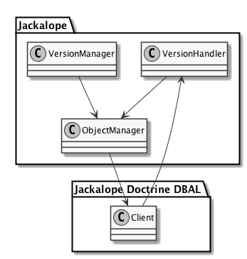
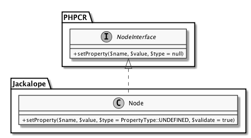
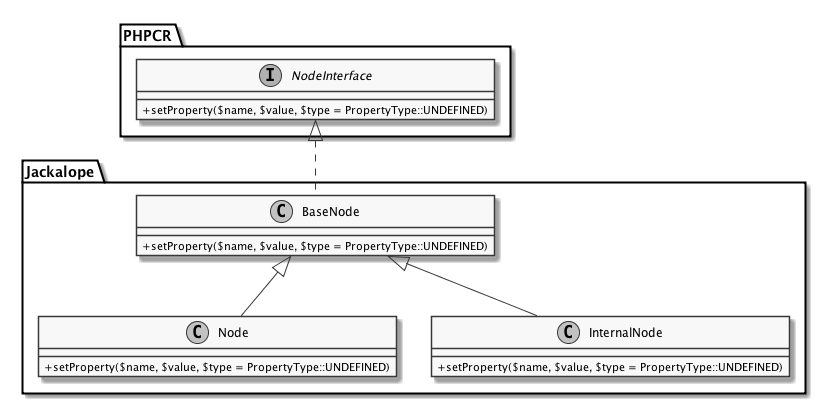
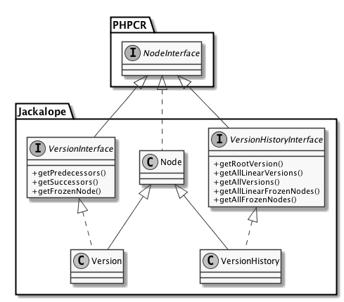

# Discussion

In this chapter some of the solutions elaborated in this thesis will be
discussed. There might be better solutions for some of the solved problems,
which have not been implemented for various reasons. The most common reason is
keeping backwards compatibility, so some of the discussed better solutions
could be implemented in a future version of Jackalope, which then will break
the backwards compatibility.

Some of the changes would have been possible before the next major release, but
they were not in the scope of this thesis, nor in the scope of the work that
should have been done in the pull requests created on GitHub. Additionally they
are not completely necessary, and therfore would have produced more work than
required. For this reason it was easier to skip these changes, and the changes
can be introduced in separate pull requests. This way it is easier for the
maintainers to review the code and check the effects of the changes.

## Node type checks

Probably one of the most repetitive tasks while implementing versioning was to
check if a node has a certain mixin, namely one of `mix:simpleVersionable` or
`mix:versionable` (which inherits from the first one), attached. These mixins
define some required properties for the versioning mechanisms and are required
to be present on the node if versioning operations are executed on it. If this
is not the case an `UnsupportedRepositoryOperationException` is thrown.

In order to do this the `isNodeType` method exists on the `Node` class. In
addition the `VersionHandler` has two constants defined:

```php
class VersionHandler
{
    const MIX_VERSIONABLE = 'mix:versionable';
    const MIX_SIMPLE_VERSIONABLE = 'mix:simpleVersionable';

    // ...
}
```

The problem here is that the information is now duplicated in some way, because
the mixins are already described in the `NodeTypeInterface`, but in a different
notation.

```php
interface NodeTypeInterface
    extends \PHPCR\NodeType\NodeTypeDefinitionInterface
{
    // ...
    const MIX_SIMPLE_VERSIONABLE =
        "{http://www.jcp.org/mix/1.0}simpleVersionable";

    const MIX_VERSIONABLE =
        "{http://www.jcp.org/mix/1.0}versionable";
    // ...
}
```

The URL written in curly braces acts as the namespace, so that different node
types or mixins do not collide with each other. However, these URLs are not
very comfortable to write. For that reason shorter names like `mix` instead of
the URLs are introduced. In combination with the fact that the `isNodeType`
method only supports the shorter name, this causes the duplication of this
information in both interfaces.

The best solution would be to use the information available in the
`NamespaceRegistry`. This class knows about the mapping between these URLs and
the short names of the namespaces. But the method should also work with the
current notation, so it should work with both variants of the namespace
representation.

Currently the method call to check if a node has a given node type looks
something like this in the `VersionHandler`:

```php
$node->isNodeType(static::MIX_SIMPLE_VERSIONABLE);
```

As can be seen the `static` keyword is used, so this call uses the information,
which has been duplicated in the `VersionHandler`. If the `isNodeType` method
would also work with the extended version of the mixin names used in the
`NodeTypeInterface` the newly introduced duplicated constants in the
`VersionHandler` could easily be removed, and the already existing constants
could be used instead.

```php
$node->isNodeType(NodeTypeInterface::MIX_SIMPLE_VERSIONABLE);
```

Of course this would also have the advantage that in case of a change in the
mixin names the code would have to be adjusted in only one location.

## Mixing of layers

The design considerations already explained in Chapter 3.2 were the cleanest
way to integrate optional versioning into Jackalope while maintaing backwards
compatibility. Maintaining backwards compatibility was absolutely necessary,
but the resulted design has some drawbacks.

First the code for the login has to be adapted, so that an instance of the
`VersionHandler` is set on the `Client`. This is done in the `login` method of
the `Repository` class, which finally returns a `Session` object.

```php
public function login(
    CredentialsInterface $credentials = null,
    $workspaceName = null
) {
    /** @var $session Session */
    $session = $this->factory->get(
        'Session', 
        array(
            $this,
            $workspaceName,
            $credentials,
            $this->transport
        )
    );
    $session->setSessionOption(
        Session::OPTION_AUTO_LASTMODIFIED,
        $this->options[Session::OPTION_AUTO_LASTMODIFIED]
    );
    if ($this->options['transactions']) {
        $utx = $this->factory->get(
            'Transaction\\UserTransaction',
            array(
                $this->transport,
                $session,
                $session->getObjectManager()
            )
        );
        $session->getWorkspace()->setTransactionManager($utx);
    }

    if ($this->transport instanceof GenericVersioningInterface) {
        $this->transport
            ->setVersionHandler(new VersionHandler($session));
    }

    return $session;
}
```

The `factory` variable contains a `get` method, which just retrieves a name and
some parameters. The name will be looked up in some namespaces, and a new 
reflection class is created. The reflection class is cached, but everytime the
`get` method is called a new object is created, whereby the given array is
passed to the constructor. This design was chosen, because it is quite easy to
offer another factory, which returns different classes for testing purposes.

However, this is not a replacement for a dependency injection container. This
is one of the reasons it was so hard to get a reference of the `VersionHandler`
into the `Client` class resp. the `transport` variable. In a dependency
injection environment like Symfony it would have been quite easy to inject this
optional parameter via a setter injection, since it is available all the time,
and it does not matter where exactly the object was created or where a
reference to it is kept. Actually the reason for this is that the dependency
injection container creates all objects and keeps a reference to all of them.
But it is of course not possible to use Symfony in Jackalope, since the library
tries not to couple itself to the usage of any specific framework, which is
considered best practice. The framework modules or bundles, as they are called
in Symfony, should then only integrate the library into the framework
[see @noback2014].

So developing this library directly as a Symfony bundle would solve this single
issue, but couples the library to a specific framework and therefore forces
people to use a certain framework, although they might prefer a different one.
So this is not the solution, but there is another one. Fabien Potencier, the
creator of the Symfony framework, has also created a very simple dependency
injection container called Pimple.[^25] With this little dependency tasks like
setting the `VersionHandler` as shown in the listing above would get a lot
easier and more elegant. Another option would be to implement an own dependency
injection container, since this pattern is not very complicated. This way it
could be optimized, both in performance and usage, for this special use case,
and as a nice side effect there would be one dependency less.



Another issue is that there are circular references, which are problematic in
different ways. These dependencies are shown in Figure 4.1, where you can see
that the classes `ObjectManager`, `VersionHandler` and `Client` share a
circular reference.

Circular dependencies are usually an indicator for bad design, especially if an
application uses some kind of layer architecture. Unidirectional relations and
dependencies are a lot easier to handle, because the effect of any change is
easier to estimate.

A possible solution would be to put more logic into the `VersionManager`, and
let every transport layer have its own implementation of the  `VersionManager`.
With this solution there could still be something like a
`GenericVersionManager`, which is valid for every implementation. If an
implementation wants to implement this functionality in a more specific and
maybe performant way, it should still be easily possible to replace this
implementation. Therefore the entire Jackalope library should be built more
like a plugin architecture, which could probably not be implemented without a
big break in backwards compatibility.

## Setting protected properties

During versioning certain internal properties have to be set, which should not
be manipulated by the user of the library. For instance the `jcr:isCheckedOut`
property of the `mix:versionable` mixin is a protected property, which means
it cannot be set using the `setProperty` method of the `Node`, since it checks
for this protected flag in the node type definition.

This problem has been avoided in a quite unpleasant way. Figure 4.2 shows the
implementation of these nodes.



The `Node` class can simply change the signature of the method, at least to
some extent. This behavior is possible due to the fact that PHP is a weakly
typed language with duck typing. As long as the existing method parameter
names also exist in the implementation PHP is fine with that, it also does not
matter if the default values for this parameters change, as can be seen for the
`$type` parameter. Due to its dynamic nature it is even possible to add more
parameters to the implementation, as the `$validate` parameter in the `Node`
implementation. The only requirement is that the additional parameter has a
default value, so that the method can be called only with the parameters
defined in the interface.

This fact is used to add the `$validate` parameter to the `setProperty` method,
which is true by default. So the validation of the property is executed by
default, which will fail if it is a protected property. The internals of the
library can then call the `setProperty` method with the `$validate` parameter
set to false, and the method will know based on this parameter if the
validation should be executed or not. The problem with this approach is that,
because of PHP's duck typing, anybody can call the method with this parameter.
The code would still work, even if the parameter does not exist, because PHP
just ignores the passed arguments which do not match any parameter.

In consequence this implies that the user of this library could easily update
protected properties, which should actually only be updated by the system. The
`jcr:isCheckedOut` property is a good example. The user should not be able to
change the value of it, instead it should only be updated by the `checkin`,
`checkout` and `restore` methods of the `VersionManager`.



In consequence this implies that the user of this library could easily update
protected properties, which should actually only be updated by the system. The
`jcr:isCheckedOut` property is a good example. The user should not be able to
change the value of it, instead it should only be updated by the `checkin`,
`checkout` and `restore` methods of the `VersionManager`.

A better solution would be to have different classes for the internal and
external representation of a node, as figure 4.3 shows.

First of all it feels a lot cleaner if the signature in every class
implementing the `NodeInterface` looks exactly the same. A `BaseNode` would
extract all the common logic from the `Node` and `InternalNode`.
The `InternalNode` could then be used in the library itself, so that any value
can be set, even the values of protected properties. To implement the current
system there would not even be the need of an `InternalNode`, since the
`BaseNode` would be sufficient for that, but there might also be other
requirements the `InternalNode` could fulfill. The `Node` could then do the
validation before it calls the method of its parent class.

## Caching node types

Nodes can be instantiated in different classes, which allows to add certain
methods to the `Node` class. An example of this can be seen in figure 4.4.



The `NodeInterface` contains a lot of different methods, and they are not of
real importance here, so they are left out. What is essential here, is that
there is also a `VersionInterface` and a `VersionHistoryInterface`, together
with an implementation. They are not part of the PHPCR specification but of
Jackalope. They contain some convenience function and reduce duplication of
code, since the written code makes less usage of strings. So if the caller
wants to get all predecessors of a version it would be written similar to this
(without the derivations of the `Node`):

```php
$predecessors = $node->getPropertyValue('jcr:predecessors');
```

The usage of the `Version` class makes this call a bit more semantic:

```php
$predecessors = $version->getPredecessors();
```

Apart from the better readability it also makes development easier, since the
`getPredecessors` method has a PHPDoc[^26], which lets the developer know that
an array of `VersionInterface` implementations is returned, and the IDE can
tell him the further possibilities. So, for example, it knows that there is a
`getFrozenNode` method on each of the elements in the `$predecessors` array the
developer is able to call.

To enable this, some methods of the `ObjectManager`, which are returning a
Node, take an optional `$class` argument. If it is not provided the basic
`Node` class is taken, otherwise it will take the class passed in the `$class`
argument. So there are many calls in the `VersionHandler` looking like this:

```php
$baseVersionNode = $this->objectManager->getNodeByIdentifier(
    $baseVersionUuid,
    'Version\Version'
);
```

This tells the `ObjectManager` it should load the node with the identifier
`$baseVersionUuid` and put its content into an instance of the class `Version`.
This works as expected, the only problem that appeared during the development
was that the caching is implemented in a quite confusing way. The second
argument in the previous listing is a part of the cache key. So if the second
argument is not passed by convenience or because  the additional methods are
simply not needed, then a new instance instead of the same reference is
returned.

This behavior is causing some problems, because when the `ObjectManager` loads
a node, edits it, and marks it as modified using the `setModified` method, it
will not be updated via the `Session`. The reason for this is, that the
`ObjectManager` will iterate over the cached entries, and only save the
modified ones. But since new nodes instead of the cached ones have been marked
as modified the nodes will not be adjusted in the database. So it is necessary
to load the nodes like in the previous listing, although this is cumbersome and
error-prone.

There are two possible solutions to this problem. The first one is to remove
the class name as cache key, so that it does not matter which class is
instantiated, and the `ObjectManager` still uses the correct cache entry. This
was not implemented, because it would take quite a lot of effort to replace
all affected locations.

The better solution would be to introduce a mapping between node types and PHP
classes. This would mean that the optional parameter for the class in all the
`ObjectManager` methods like `getNodeByIdentifier` would be removed, and the
system itself knows that a node with the primary type `nt:version` should be
instantiated with the `Version` class, a node with the primary type
`nt:versionHistory` as a `VersionHistory` class and so on. This would not only
make the call of these methods easier, since one parameter can be omitted, but
would also make it impossible to load a node with the wrong class and therefore
also impossible to write the object into the wrong cache. Furthermore it would
make the class name as part of the cache key complete obsolete. This would also
reduce complexity, since the cache for loading nodes by path is a two
dimensional array, one dimension for the class name and one for the path. If
this mapping would be implemented this could be changed to an array of one
dimension, which would also resolve the strange inconsistency that the cache
for the UUID already is an array with on dimension.

## Object store

The object store consists basically of the two caches mentioned in the previous
chapter. But these caches or object stores introduce another difficult problem.

At the start of the `save` method of the `ObjectManager` there is the following
code.

```php
// loop through cached nodes and commit all dirty and set them to clean.
if (isset($this->objectsByPath['Node'])) {
    foreach ($this->objectsByPath['Node'] as $node) {
        $this->updateNode($node);
    }
}
```

So what this code does is to loop over all nodes in the cache, and call the
`updateNode` method on them, which writes the changes from the node to the 
persistent memory using some methods from the `Client` class of the transport
layer. The point here is that only the nodes are saved, which have been
instantiated with the `Node` class.

This behavior can also be inferred from the start as a Jackrabbit client,
because if Jackrabbit is used the nodes with the `Node` class are really the
only ones with the need to be saved, since all the versioning nodes are already
handled by Jackrabbit itself. If the other node types would also be saved in
Jackrabbit by Jackalope, it would lead to unexpected and unpredictable
behavior.

For now this issue was solved with adding the following code right after the
one shown previously.

```php
if (isset($this->objectsByPath['Version\\Version'])
    && $this->transport instanceof GenericVersioningInterface
) {
    foreach ($this->objectsByPath['Version\\Version'] as $node) {
        $this->updateNode($node);
    }
}
```

This code checks if there are any nodes instantiated with the `Version` class,
and also updates all of these nodes with the `updateNode` method, but only
if the transport layer implements the `GenericVersioningInterface`. This way
the changes on these nodes will also not be sent to Jackrabbit, but to any
relational database system, since Jackalope Doctrine DBAL implements this
interface.

The maintainers of Jackalope also know that this part of the code should be
refactored in the next major version. One idea would be similar to the one
in the chapter about mixing layers. A plugin architecture could help to let
transport layers inject their own logic into this part of Jackalope. But maybe
this would not even be necessary, if the Jackrabbit transport layer would make
sure that only nodes with the class `Node` would be in the object store.
Actually this would even be a necessity, if the class name would be removed 
as a dimension from this `objectsByPath` array. 

[^25]: <http://pimple.sensiolabs.org/>
[^26]: <http://www.phpdoc.org/>
